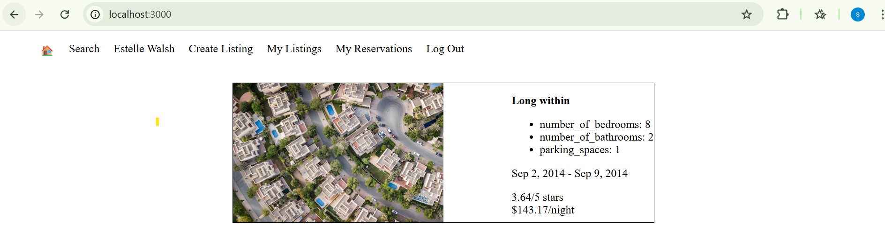

# LightBnB
A simple multi-page Airbnb clone that uses server-side JavaScript (Node.js) to serve data from a PostgreSQL database to web pages via SQL queries.

This application is built as part of a Lighthouse Labs bootcamp project.

## 🚀 Project Overview

### ⚙️ Setup Instructions

#### 1. Clone the Repository

git clone https://github.com/SimarpreetSidhu/LightBnB
cd LightBnB

#### 2. Install Dependencies

Navigate into the main web app folder and install required packages:

cd LightBnB_WebApp

npm install

#### 3. Run the Server

Start the Express server:

npm run local

Once started, open your browser and navigate to:  
http://localhost:3000/

## ## ✨ Features (Implemented Functions)

- `getAllProperties(options, limit)`  
  → Retrieves property listings from the database with optional filters such as city, minimum/maximum price, rating, etc.

- `getUserWithEmail(email)`  
  → Returns a user from the database based on their email address for login validation.

- `getUserWithId(id)`  
  → Retrieves a user's data by their user ID.

- `addUser(user)`  
  → Adds a new user to the database with name, email, and password.

- `getAllReservations(guest_id, limit)`  
  → Retrieves all past reservations for a specific user (if logged in), joined with property details.

- `addProperty(property)`  
  → Inserts a new property listing into the database, submitted by a host.

## 📸 Screenshot

